# CREMA · Handoff v0.2.2

Skin web (vanilla JS) para a **Decent DE1**, rodando sobre o app **Decaid / ReaPrime**.
Este documento fecha a versão atual e serve de **base para o redesign completo**: mostra cada
tela, o que ela faz, de onde vêm os dados e quais são os limites conhecidos.

- **Repositório da skin:** https://github.com/thiraraujo/decaid-skin-crema (branch `main` = o que a máquina instala)
- **Versão:** `0.2.2` · `manifest.json` → `{ id: "crema", entry: "index.html" }`
- **Instalação:** Decaid → Skins → *Install from GitHub branch* → auto-update por ETag
- **Prints:** `docs/handoff/screens/` — capturados a 2× (2640×800 → PNG 2640×1600) contra o
  **Bridge real** (ReaPrime + MockDe1), não contra mock da skin.

---

## 1. Arquitetura em 1 minuto

```
index.html         canvas fixo 1320×800 (.app) escalado por JS (fitApp) → independe de dpr
├── css/tokens.css design tokens (cores, fontes, raios)
├── css/main.css   header, rail, gráfico, card de shot, tabela de fases
├── css/modals.css todos os modais
└── src/
    ├── main.js    bootstrap: detecta host → api (Bridge) ou mock → liga chart + status
    ├── api.js     cliente REST/WS do ReaPrime (localhost:8080/api/v1)
    ├── mock.js    fonte simulada (só quando NÃO há Bridge — dev visual)
    ├── store.js   estado central + pub/sub
    ├── chart.js   gráfico SVG (ao vivo + estático)
    ├── profiles.js perfis/favoritos de fallback
    ├── host.js    ações do app host (sleep, abrir Settings nativo)
    └── ui.js      TODA a interação (modais, steppers, presets, histórico, editor)
```

**Regra de ouro adotada:** com Bridge conectado, **nunca** usar mock. Sem dado real a UI mostra
`—`, nunca um número inventado.

### Fluxo de dados

| Origem | Vai para |
|---|---|
| WS `machine/snapshot` | temperaturas, estado da máquina (badge + botão), séries do gráfico ao vivo |
| WS `scale/snapshot` | peso, status da balança, série de peso |
| `GET /profiles` | barra de favoritos + picker de perfis |
| `GET /shots` | card de histórico + navegador por café |
| `GET /shots/{id}` | séries (measurements) do shot gravado no gráfico |
| `GET /beans` `/grinders` | biblioteca Café & Moedor e pickers do editor |
| `PUT /workflow` | dose, yield, café, moedor, moagem, flush, água, vapor, **perfil** |
| `PUT /shots/{id}` | edição de shot passado (só `annotations` — o `workflow` é imutável) |
| `PUT /machine/state/{s}` | ESPRESSO / STOP / WAKE / SLEEP |

---

## 2. Telas

### 2.1 Home — máquina pronta
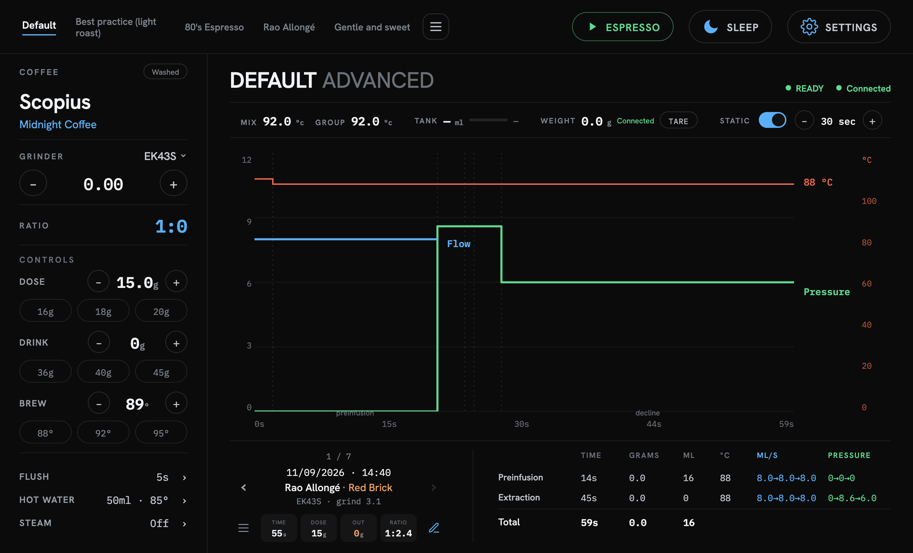

Tela única, sem navegação: **header + rail esquerdo + área principal**. Tudo o que o usuário faz
antes e depois do shot cabe aqui.

- **Header (esq.):** 5 perfis favoritos. *Toque* = selecionar (aplica na máquina e desenha o
  planejado no gráfico). *Toque duplo* = trocar o perfil daquele slot. O ícone ≡ abre a lista completa.
- **Header (dir.):** `ESPRESSO` (estado-consciente), `SLEEP`, `SETTINGS`.
- **Rail:** café/moedor atuais, stepper de moagem, ratio calculado, controles Dose/Drink/Brew com
  presets, e atalhos Flush / Hot Water / Steam.
- **Faixa de status:** Mix e Group lado a lado, Tank com barra, Weight + Connect/Tare, Static + tempo.
- **Gráfico:** herói da tela. Pressão (verde), fluxo (azul), temperatura (vermelho), peso (âmbar);
  tracejado = alvo do perfil. Rótulos ficam **sobre** a linha, à direita.
- **Rodapé:** card do último shot (esq.) + tabela por fase (dir.).

Detalhes: [header](screens/01b-detalhe-header.png) · [faixa de status](screens/01c-detalhe-stat-strip.png) · [rail](screens/01d-detalhe-rail.png) · [rodapé](screens/01e-detalhe-shot-card.png)

---

### 2.2 Extração ao vivo
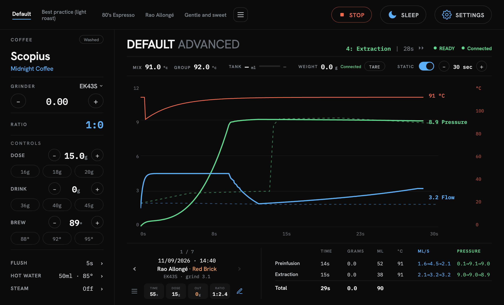

Disparada pelo botão `ESPRESSO` (ou pelo GHC, quando a máquina tem botão físico — nesse caso o
botão da tela some sozinho).

- O botão vira **STOP** vermelho; só ele responde durante o shot.
- No cabeçalho aparece o **passo atual** (`4: Extraction | 29s ⏩`).
- As curvas crescem em tempo real; a tabela de fases recalcula a cada snapshot.
- O **rail é travado** (`pointer-events:none` + escurecido) para não alterar a receita no meio da extração.
  > ⚠️ Nos prints o rail aparece com brilho normal: o rasterizador usado ignora `filter: brightness()`.
  > Na máquina ele fica visivelmente escurecido.

Início do shot: [~10s, preinfusão](screens/14-shot-ao-vivo.png) · [cabeçalho com a fase](screens/14c-detalhe-cabecalho-fase.png)

---

### 2.3 Fim do shot
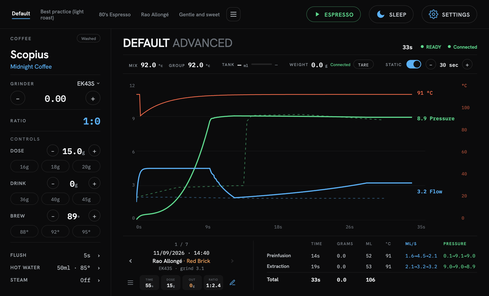

A curva congela, o cabeçalho passa a mostrar só o tempo final, o rail destrava e o botão volta a
`ESPRESSO`. O shot entra no histórico na próxima leitura.

---

### 2.4 Shot gravado no gráfico
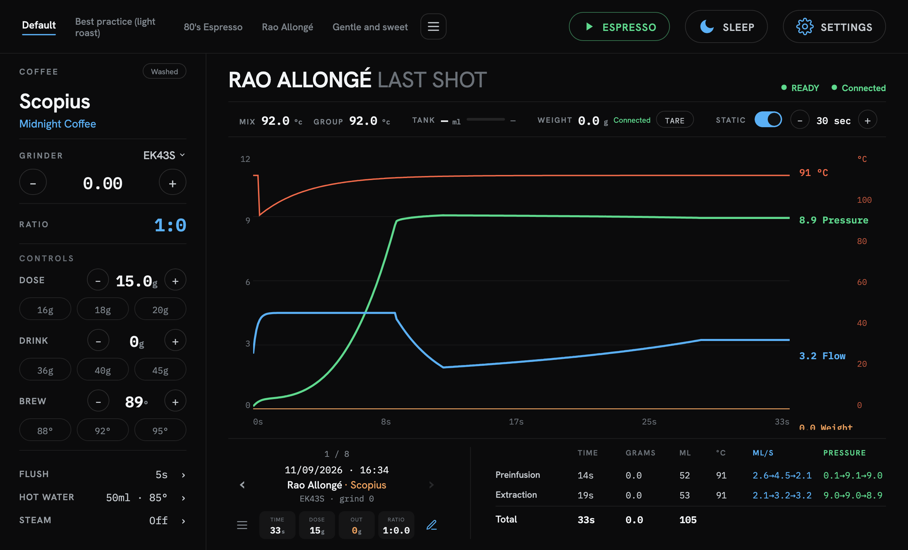

Tocar no card do rodapé carrega `GET /shots/{id}` e redesenha o gráfico com as séries daquele
shot; o título vira `<perfil> Last shot`. As setas `‹ ›` navegam e o gráfico acompanha.

- `‹` (esquerda) = shot **mais antigo** (1/8 → 2/8)
- `›` (direita) = shot **mais recente**
- Extremos ficam desabilitados (sem dar a volta).

[Navegando para o shot anterior](screens/18-navegacao-shot-anterior.png)

**Card do shot** ([detalhe](screens/17b-detalhe-card-shot.png)) — o layout fechado na última iteração:

```
              1 / 8                ← posição centralizada
  ‹     11/09/2026 · 14:40     ›   ← data
        Rao Allongé · Red Brick    ← perfil · café
        EK43S · grind 3.1          ← moedor · moagem
  ≡  [TIME] [DOSE] [OUT] [RATIO] ✎ ← ícones sem balão nas pontas
```

`≡` abre o histórico por café · `✎` abre o editor do shot.

---

### 2.5 Perfil planejado
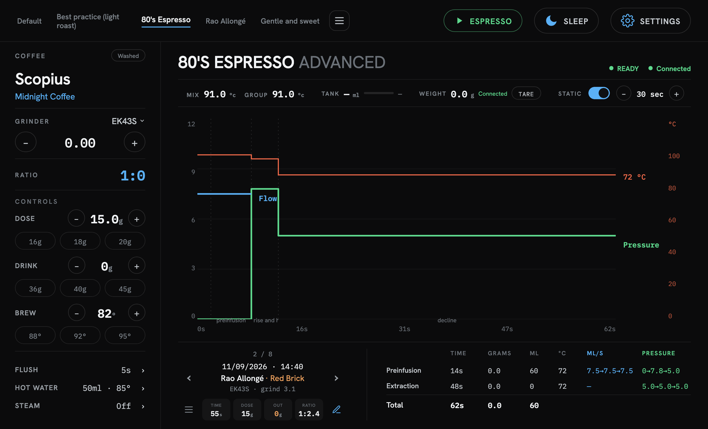

Selecionar um perfil desenha a **curva planejada** (degraus de pressão/fluxo/temperatura por step)
e preenche a tabela com Preinfusion / Extraction / Total previstos. O `Brew` do rail passa a
refletir a temperatura real do 1º step do perfil.

---

### 2.6 Static ligado/desligado
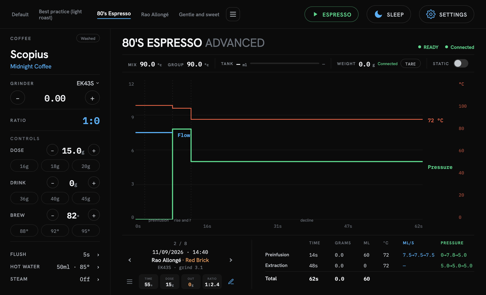

- **Static ON** (padrão): eixo X fixo no tempo escolhido (`30 sec`, ajustável de 5 em 5).
- **Static OFF**: eixo X dinâmico, acompanha a extração; o stepper de tempo some.

---

### 2.7 Máquina dormindo
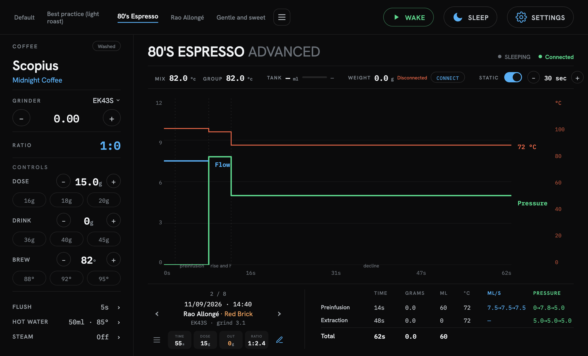

Badge `SLEEPING` cinza e o botão do header vira `WAKE`. Os [badges](screens/21b-detalhe-badges.png)
cobrem todo o enum da máquina:

| Estado | Badge | Botão |
|---|---|---|
| idle / espresso / steam / hotWater / flush | `READY` verde | ESPRESSO / STOP |
| heating / preheating / busy / cleaning / descaling / calibration… | `HEATING`, `BUSY`… âmbar | desabilitado |
| sleeping | `SLEEPING` cinza | WAKE |
| needsWater | `REFILL` amarelo | desabilitado |
| error / fwUpgrade | `ERROR` / `FIRMWARE` vermelho | desabilitado |
| sem conexão | `—` cinza apagado | — |

---

### 2.8 Escolher perfil
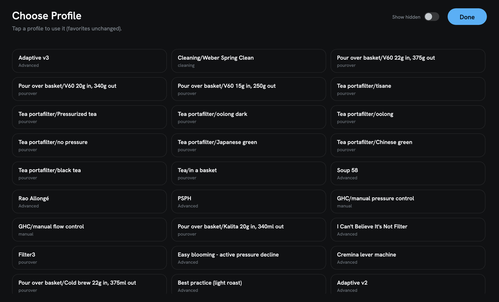

Aberto pelo ≡ do header (navegar) ou por toque duplo num favorito (trocar aquele slot).
O subtítulo muda conforme o modo.

**Show hidden** ([print](screens/03-perfis-show-hidden.png)) revela os perfis ocultos da máquina e
dá a cada card um toggle de visibilidade que grava via `PUT /profiles/{id}/visibility`.

---

### 2.9 Café & Moedor
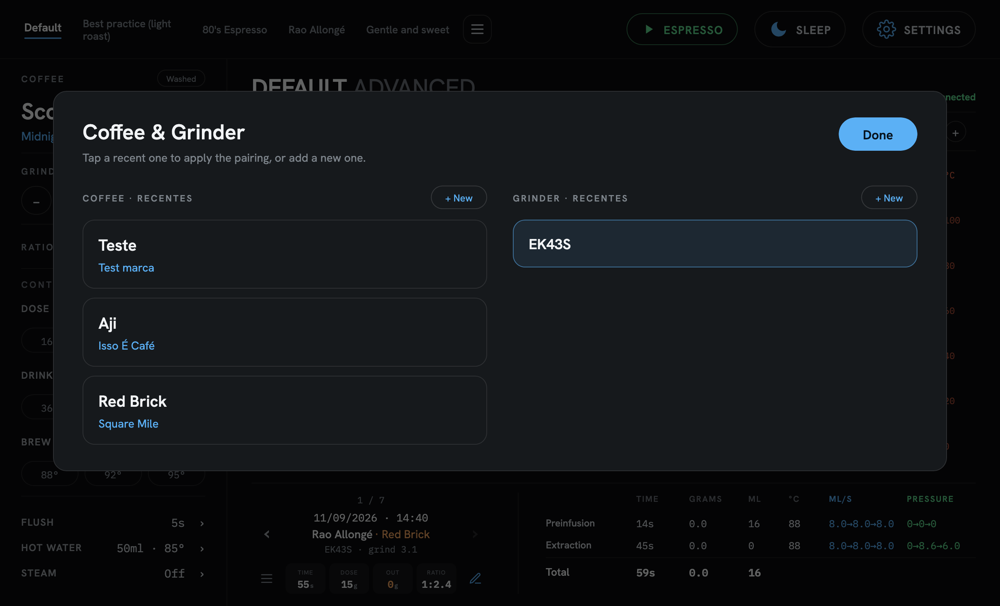

Duas colunas lidas de `/beans` e `/grinders`. Tocar num card aplica ao próximo shot
(`PUT /workflow { context }`). O card ativo fica marcado em azul.

`+ New` abre o formulário inline:

| Café | Moedor |
|---|---|
| 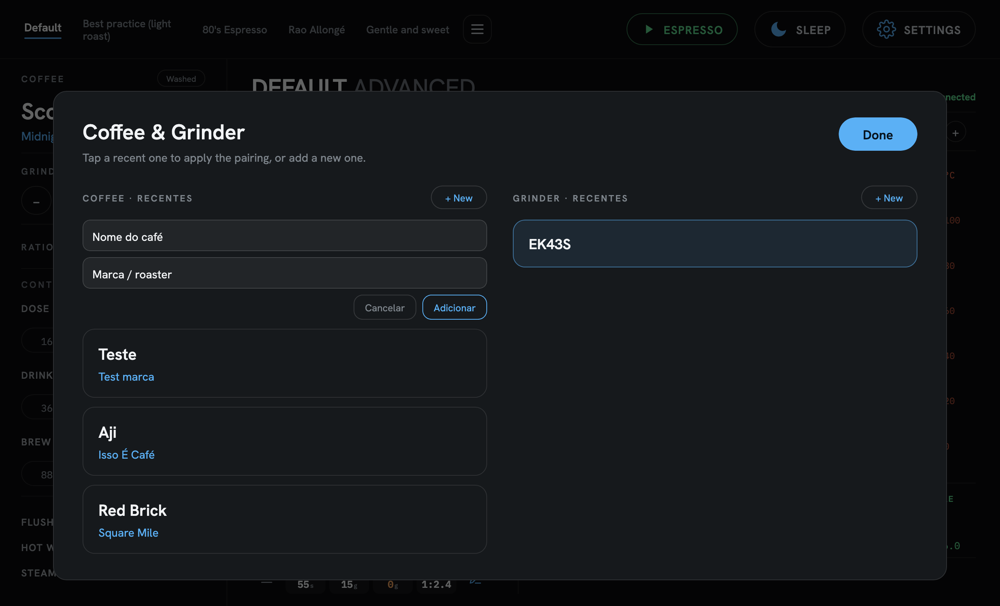 | 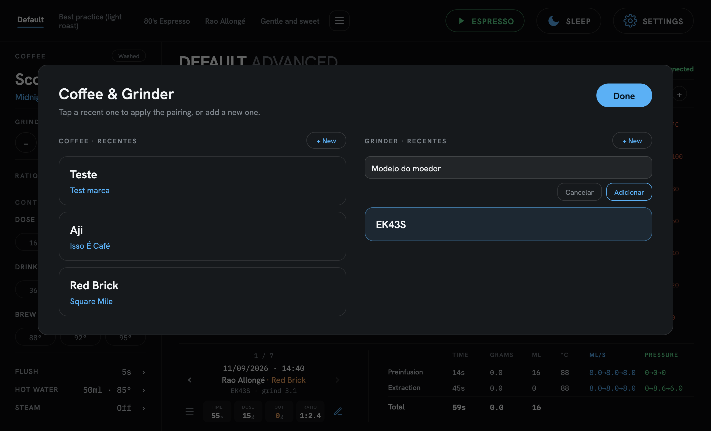 |

Café exige **nome + marca** (`POST /beans`); moedor exige **modelo** (`POST /grinders`).

---

### 2.10 Histórico por café — *o recurso-assinatura*
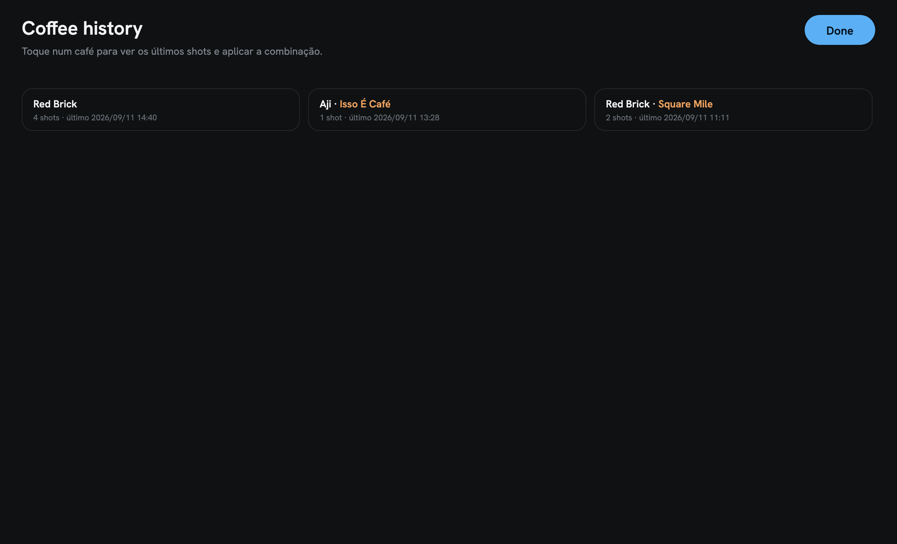

Agrupa até 60 shots por café/marca, com contagem e data do último. É a resposta para
*"como eu estava moendo este café da última vez?"*.

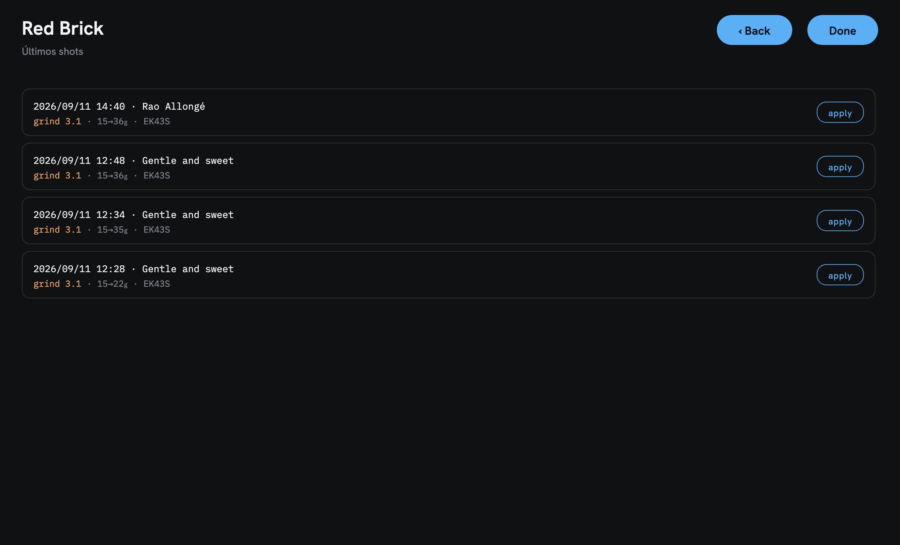

Ao entrar num café: os 5 shots mais recentes com **moagem, dose→yield, moedor e perfil**.
O botão `apply` devolve o conjunto café + moedor + moagem para o rail e para o workflow — em um toque.

---

### 2.11 Editar shot
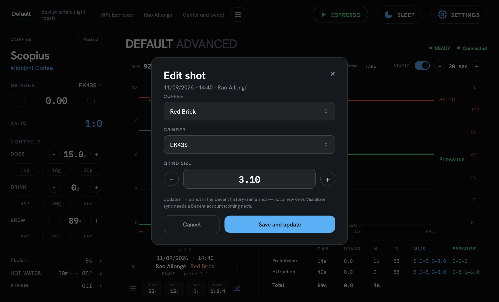

Corrige um shot já gravado (quando se esqueceu de trocar o café, por exemplo). Café e moedor são
**pickers** que listam a biblioteca ([aberto](screens/10-editar-shot-picker.png)); a moagem é um stepper de 0,1.

Grava com `PUT /shots/{id}` em `annotations.extras` — **o mesmo shot**, não um novo.

> **Limite conhecido:** o `workflow` do shot é imutável na API; por isso a correção mora em
> `annotations.extras`. O re-upload no Visualizer depende de login da conta Decent (Fase 2).

---

### 2.12 Numpad
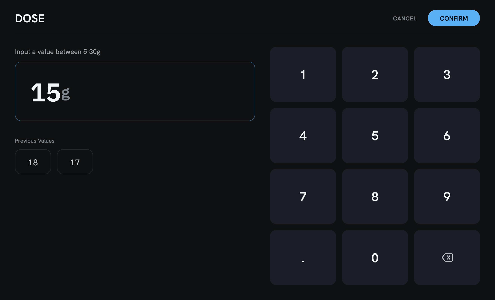

Toque no valor de Grinder / Dose / Drink / Brew. Mostra a faixa válida, guarda os últimos 3
valores usados e faz clamp no confirm.

---

### 2.13 Ajustes (Flush / Água quente / Vapor)
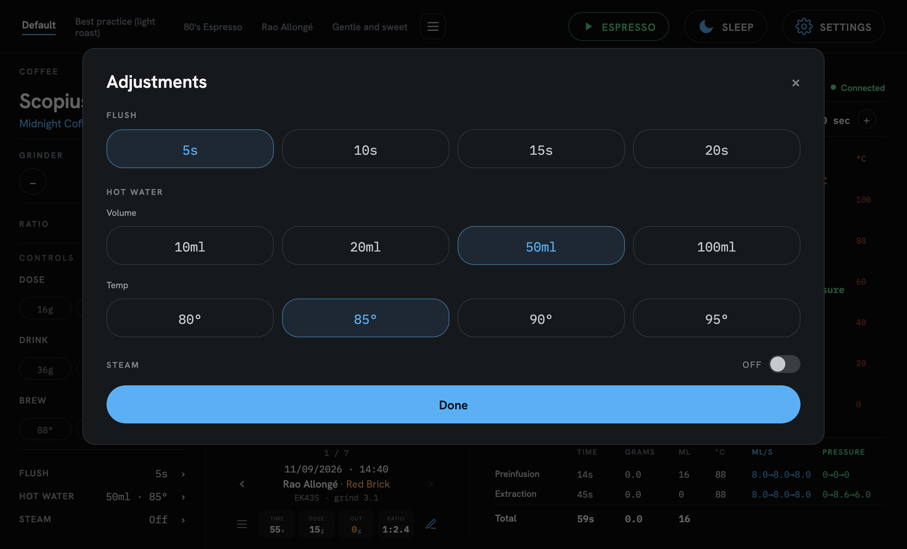

Chips grandes, touch-first. Ligando o vapor aparecem tempo e fluxo:

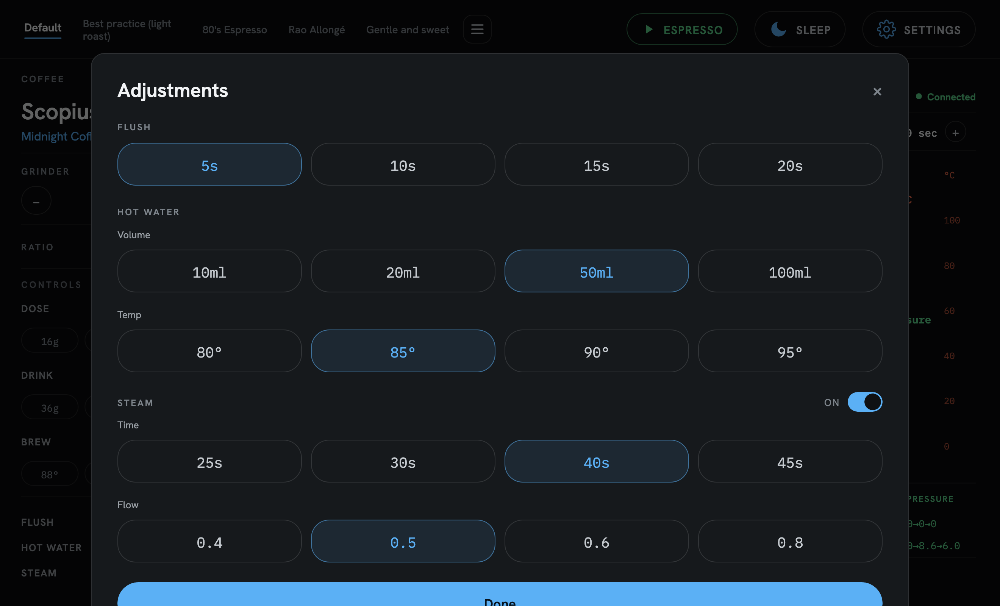

Tudo é gravado no workflow (`rinseData`, `hotWaterData`, `steamSettings`) e refletido no rail.

---

### 2.14 Settings
Sem print: o botão `SETTINGS` **sai da skin** e navega para o plugin nativo do Decaid
(`/api/v1/plugins/settings.reaplugin/ui?backName=CREMA`), que volta com um botão rotulado "CREMA".
É tela do app, não da skin. Se quiser o print dela para o redesign, é só capturar no iPad.

---

## 3. Design system

| Token | Valor | Uso |
|---|---|---|
| `--bg` | `#0F1113` | fundo |
| `--modal-bg` | `#16191C` | modais |
| `--text` / `--text-2` / `--text-3` | `#F2F4F6` / `#7E858C` / `#6B7178` | primário / rótulos / eixos |
| `--blue` | `#5BB0F5` | fluxo, primário, toggles, seleção |
| `--green` | `#5FD98E` | pressão, READY/Connected |
| `--red` | `#F06A4A` | temperatura, Disconnected, STOP |
| `--amber` | `#F0A35F` | peso / "Out" |
| `--sans` | Hanken Grotesk | títulos e rótulos |
| `--mono` | IBM Plex Mono | **todo número** |
| `--r-modal` / `--r-card` / `--r-pill` | 18 / 16 / 24 px | raios |

**Princípios que valem manter no redesign:**
1. **Tela única.** Nada de navegação por abas; modais para o resto.
2. **Número é mono.** Dá alinhamento vertical e leitura rápida a 1 m de distância.
3. **Touch-first.** Sem hover; alvos de 40 px+; `:active` como único feedback.
4. **Honestidade de dados.** Sem dado → `—`. Nunca preencher com valor plausível.
5. **Canvas fixo 1320×800** escalado por transform: layout previsível em qualquer iPad/kiosk.

---

## 4. O que ainda falta (entrada para o redesign)

| Item | Estado | Bloqueio |
|---|---|---|
| Visualizer (upload / re-upload do shot editado) | ⏳ | precisa logar a conta Decent em `/account/decent` |
| Fases reais no gráfico (transição via `profileFrame` / `shotState`) | ⏳ | hoje o corte Preinfusion/Extraction é fixo em 14 s |
| Tank real (nível + %) | ⏳ | REST não expõe; depende do canal WS `waterLevels` — hoje `—` honesto |
| Balança: auto-reconexão | ⏳ | hoje é manual pelo `CONNECT` |
| Steam / Água quente / Flush pela tela | ⏳ | só ESPRESSO/STOP estão na tela hoje |
| Stop no peso-alvo | ⏳ | — |
| Notas e rating do shot (campos já existem na API) | ⏳ | UI não expõe |

---

## 5. Como rodar e publicar

Com o Bridge do Decaid rodando em `:8080`, sirva a pasta da skin e abra `http://localhost:4173`:

```bash
python3 -m http.server 4173 --directory ipad/crema
```

Publicação: `rsync` do conteúdo de `ipad/crema/` para o clone de `decaid-skin-crema`, commit e
**force-push na `main`** (sobrescrever sempre, sem PR e sem release até a v1). A máquina puxa a
atualização em *Check for updates* ou via `POST /api/v1/webui/skins/update`.

> Combinado do projeto: versões `v0.x` vão sendo sobrescritas; na **v1** o histórico do repositório
> será refeito do zero (orphan push).
</content>
